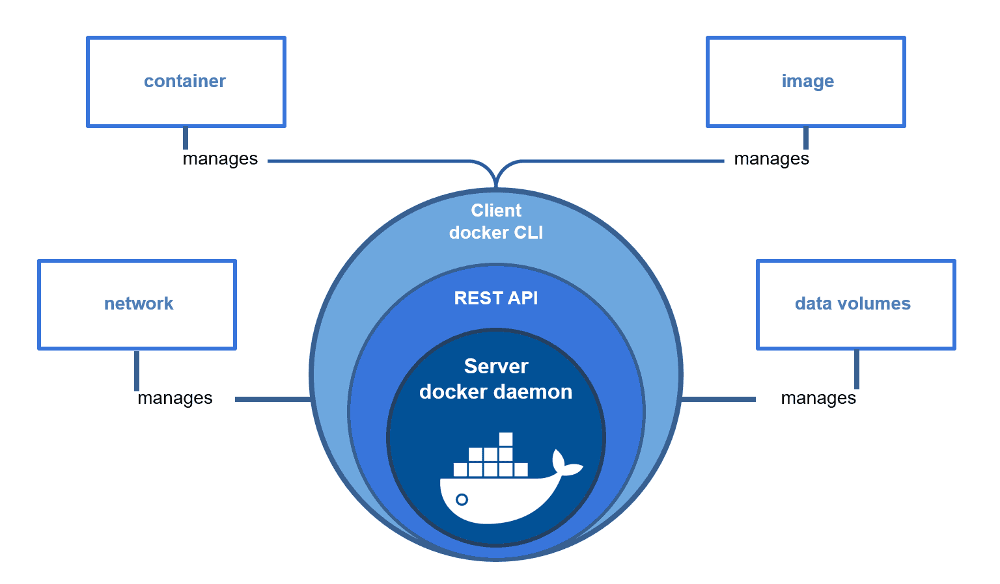

# Introduction to docker and its Architecture

Docker is a set of platform as a service products that use OS-level virtualization to deliver software in packages called containers

It uses containerization technology, allowing developers to package an application along with all its dependencies, libraries, and configurations into a single container. This ensures that the application runs consistently across different environments, whether it's a developer's local machine, a testing environment, or production servers.

**Containerization vs VMS**

| **Aspect** | **Containers** | **VMs** |
| --- | --- | --- |
| **Isolation** | Shares host OS kernel, isolated user spaces | Runs own OS on top of a hypervisor |
| **Overhead** | Low, lightweight | High, includes full OS per VM |
| **Startup Time** | Fast (seconds) | Slower (minutes) |
| **Resource Utilization** | More efficient, higher density | Less efficient, lower density |
| **Portability** | High, consistent across environments | Moderate, less portable due to larger size |
| **Use Cases** | Microservices, CI/CD, scalable applications | Legacy applications, strong isolation needs |
| **Management** | Easier with tools like Docker Compose, Kubernetes | More complex with platforms like VMware, Hyper-V |

In above figure we can see how Docker works and how it’s aspects are  interconnected with each other

[Next](./What are images in Docker 1016dcdd090e806399a8c8453ffc01fe.md)

[Home](./Readme.md)

